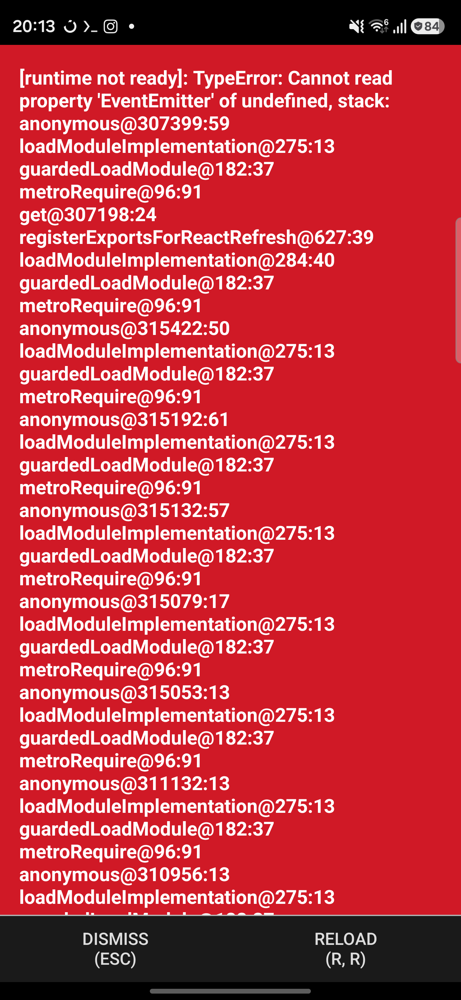
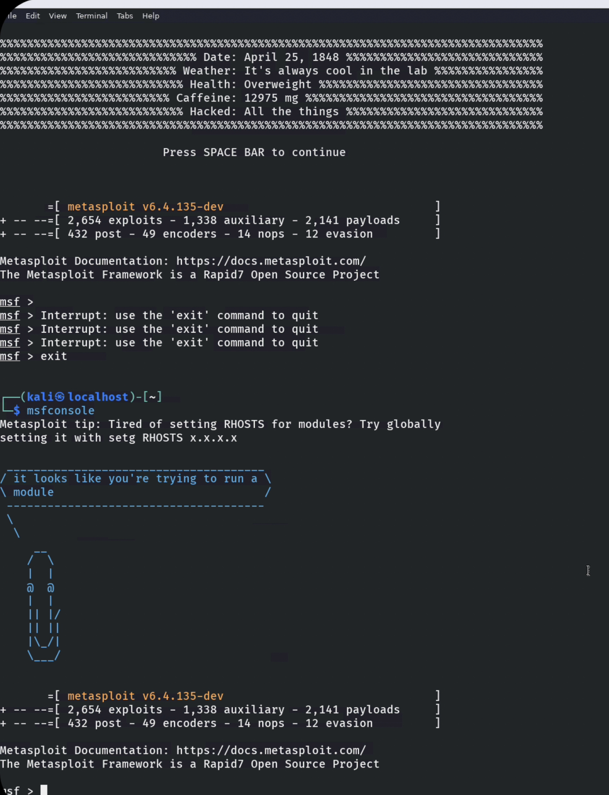
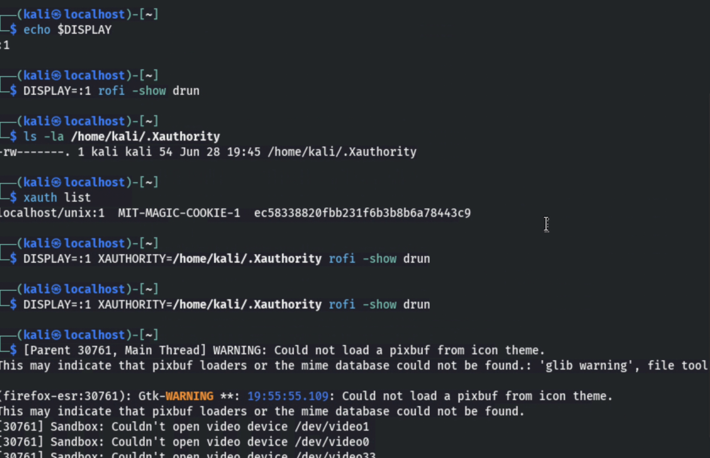
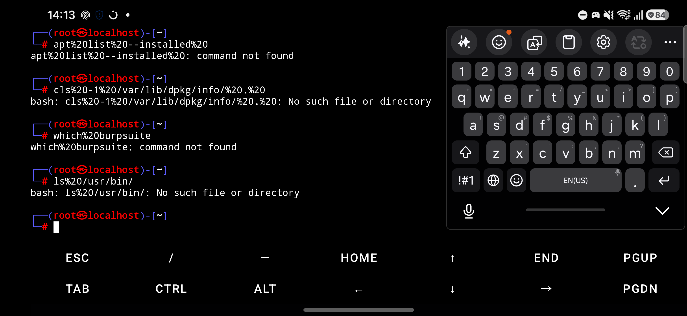
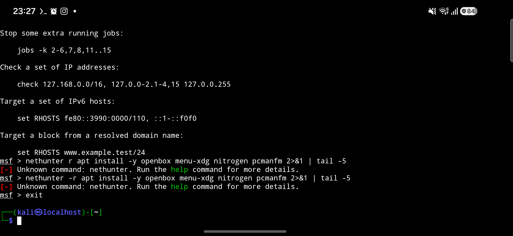

# samsung-kali-nethunter-rootless

> **Run Kali Linux + the full offensive-security toolkit on a stock Samsung Galaxy phone.**
> **No root. No bootloader unlock. No Knox trip. No warranty void.**

[](LICENSE)
[](#tested-on)
[](#warranty--knox)
[](#prerequisites)
[](#why-fluxbox-not-xfce)

---

## Screenshots

The Fluxbox desktop running on a real Samsung Galaxy S26 Ultra (SM-S948B, Snapdragon 8 Elite Gen 5, Android 16) — captured during the original 3-day setup session:

| Fluxbox desktop with Kali dragon wallpaper | Metasploit loaded with 2,654 exploits |
|:---:|:---:|
|  |  |

| Rofi app launcher (press Ctrl+Alt+R) | Termux + Hacker's Keyboard on the phone |
|:---:|:---:|
|  |  |

| Fluxbox install progress (apt working) |
|:---:|
|  |

> All screenshots are from the test phone used during development. No personal information is shown. See [Warranty & Knox](#warranty--knox) for the verification steps.

---

## Table of contents

- [What is this?](#what-is-this)
- [Tested on](#tested-on)
- [Warranty & Knox](#warranty--knox)
- [Quick start](#quick-start-3-commands)
- [What you get](#what-you-get)
- [Why Fluxbox, not XFCE?](#why-fluxbox-not-xfce)
- [How it works](#how-it-works)
- [Prerequisites](#prerequisites)
- [Installation](#installation)
- [Daily use](#daily-use)
- [Controlling the phone from your Mac](#controlling-the-phone-from-your-mac)
- [Project layout](#project-layout)
- [Comparison with similar projects](#comparison-with-similar-projects)
- [Troubleshooting](#troubleshooting)
- [Contributing](#contributing)
- [License](#license)
- [Acknowledgments](#acknowledgments)

---

## What is this?

A fully automated installer for **[Kali NetHunter Rootless](https://www.kali.org/docs/nethunter/nethunter-rootless/)** on modern Android devices. It sets up a complete Kali Linux chroot inside [Termux](https://termux.dev/) using the `proot` userspace tool, plus a working graphical desktop you can interact with from the phone or remotely from your Mac.

The official Kali NetHunter Rootless docs are two years out of date and assume that **XFCE** works as the graphical desktop. **It doesn't on 2026+ Android devices** due to an upstream `glycin`/`bwrap` regression. This project is the workaround: a battle-tested **Fluxbox** desktop with `fbpanel` + `stalonetetray` + `rofi` + `conky` that actually works.

It also ships with a companion **Mac control script** (`control-from-mac.sh`) that uses `scrcpy` to mirror the phone screen on your Mac and gives you a 9-option menu for typing, screenshots, file transfer, and wireless ADB — useful for app developers, security researchers, and anyone who doesn't want to type long commands on the on-screen keyboard.

---

## Tested on

| Device | SoC | Android | Status |
|---|---|---|---|
| **Samsung Galaxy S26 Ultra** (SM-S948B) | Snapdragon 8 Elite Gen 5 (SM8850) | 16 | ✅ Verified end-to-end |
| **Samsung Galaxy S25 Ultra** (SM-S938B) | Snapdragon 8 Elite Gen 4 (SM8750) | 15 | 🟡 Should work (untested) |
| **Samsung Galaxy A55** | Exynos 1480 | 14 | 🟡 Should work (untested) |
| **OnePlus 13** | Snapdragon 8 Gen 3 | 15 | 🟡 Should work (Samsung-specific tweaks unnecessary) |
| **Pixel 9 Pro** | Tensor G4 | 15 | 🟡 Should work (no Samsung quirks) |

If you test on another device, please open an issue or PR to add it to this list.

---

## Warranty & Knox

**This project does not touch the Knox e-fuse.** Your Samsung warranty remains intact.

| Check | Expected value |
|---|---|
| `adb shell getprop ro.boot.warranty_bit` | `0x0000` (virgin) |
| Samsung Pay / Secure Folder / Wallet | ✅ Still work |
| Banking apps (with Google Play Integrity) | ✅ Still work |
| Factory Reset Protection | ✅ Unchanged |
| OTA updates from Samsung | ✅ Still receive them |
| `release-keys` in firmware fingerprint | ✅ Still signed by Samsung |

The chroot runs entirely in **userspace**, the same way WhatsApp, Chrome, or any other app is sandboxed by Android. It cannot touch `/system/`, `/boot/`, or the bootloader.

---

## Quick start (3 commands)

On your **Mac** (with the phone connected via USB-C):

```bash
brew install android-platform-tools scrcpy
adb -d install termux.apk
adb -d install NetHunterStore.apk
```

On your **phone** (in Termux):

```bash
wget -qO install.sh https://raw.githubusercontent.com/Yogendra96/samsung-kali-nethunter-rootless/main/install.sh
bash install.sh
```

That's it. After ~25 minutes:

- A full Kali chroot with 1,800+ packages is installed
- 30+ offensive security tools (`nmap`, `msfconsole`, `burpsuite`, `seclists`, …) are ready
- The Fluxbox graphical desktop is configured
- A random VNC password is generated and displayed
- The chroot is wired to start with `nethunter kex &` and connect via the NetHunter KeX app

---

## What you get

### The chroot

- **Kali GNU/Linux Rolling 2026.x** (Debian-based, ~2.5 GB)
- **1,800+ packages** including the entire Kali metapackage
- **30+ offensive security tools** installed automatically:

| Category | Tools |
|---|---|
| **Network recon** | `nmap`, `masscan`, `netdiscover`, `nbtscan`, `enum4linux` |
| **Web app** | `burpsuite`, `nikto`, `ffuf`, `gobuster`, `dirb`, `wpscan`, `sqlmap` |
| **Exploitation** | `msfconsole` (Metasploit with 2,654+ modules), `searchsploit` |
| **Wireless** | `aircrack-ng`, `wifite`, `wpscan` (note: monitor mode requires a NetHunter kernel, see [WIRELESS.md](docs/WIRELESS.md)) |
| **Password** | `john`, `hashcat`, `hydra`, `ncrack` |
| **Sniffing/Spoofing** | `wireshark`, `tcpdump`, `responder`, `ettercap` |
| **Wordlists** | `seclists`, `rockyou.txt` |
| **Recon** | `theharvester`, `recon-ng` |
| **Forensics** | `autopsy`, `sleuthkit`, `binwalk`, `foremost` |
| **Reverse eng** | `ghidra`, `radare2`, `gdb` |
| **Networking** | `ncat`, `socat`, `curl`, `wget`, `openssl` |

### The desktop

A fully working **Fluxbox** window manager with:

- **Top taskbar** (fbpanel) with app menu, system tray, clock
- **System tray** (stalonetetray) for notification icons
- **App launcher** (rofi) — press `Ctrl+Alt+R` to open
- **System info widget** (conky)
- **Random Kali wallpaper** (feh)
- **Notification daemon**
- **Maximized xfce4-terminal** auto-launched on login
- **File manager** (pcmanfm)

### The Mac controller

A 9-option menu (`control-from-mac.sh`) for:

1. **scrcpy** — mirror the phone screen to your Mac
2. **adb shell** — open a terminal on the phone
3. **Send text** — type into the focused phone app from the Mac
4. **TCP ADB** — set up wireless ADB (unplug the USB cable after)
5. **Show device info** — model, Android version, Knox state
6. **Screenshot** — capture the phone screen to a file
7. **Install APKs** from the Mac
8. **Pull files** from the phone
9. **Push files** to the phone

---

## Why Fluxbox, not XFCE?

The official NetHunter Rootless docs (from 2024) recommend XFCE. **That doesn't work on 2026 Android devices.** Why?

```
1. xfce4-session starts
2. → xfwm4 (window manager) uses gdk-pixbuf
3. → gdk-pixbuf delegates SVG loading to glycin-loaders (sandboxed process)
4. → glycin-loaders runs `bwrap --unshare-all` to sandbox itself
5. → bwrap --unshare-all requires Linux user namespaces
6. → proot CAN'T fake user namespaces
7. → bwrap exits with error
8. → gdk-pixbuf can't load icons
9. → GTK apps crash
10. → xfce4-session aborts with "ComparingUpdateTracker (1:nan ratio) Aborted"
```

The visible error is always one of:
- `xfce4-session: ... ComparingUpdateTracker: 0 pixels in / 0 pixels out, (1:nan ratio), Aborted`
- `xfsessiond: ICE I/O Error, Disconnected from session manager`
- `GLib-GIO-ERROR: Settings schema 'org.mate.session' is not installed`
- `libEGL warning: DRI3 error: Could not get DRI3 device`

**Fluxbox is the only DE that works** because it doesn't use gdk-pixbuf, doesn't use bwrap, doesn't use dbus session bus, and doesn't use systemd. It's ~50 KB, has a simple `~/.fluxbox/startup` file, and just works.

The proot upstream has a fix in master ([termux/proot#359](https://github.com/termux/proot/pull/359), merged 2026-06-01), but it's not yet in a Termux release. Once `pkg upgrade proot` ships a version with the fix, XFCE may work again. We track this in [references/proot-pr-359.md](references/proot-pr-359.md).

See [references/glycin-bwrap-analysis.md](references/glycin-bwrap-analysis.md) for the full root cause analysis with upstream links.

---

## How it works

```
┌──────────────────────────────────────────┐
│  Samsung Galaxy phone (stock One UI)     │
│                                          │
│  ┌────────────────────────────────────┐  │
│  │  Termux (Android app, userspace)    │  │
│  │  ┌──────────────────────────────┐   │  │
│  │  │  proot (userspace chroot)    │   │  │
│  │  │  ┌──────────────────────┐   │   │  │
│  │  │  │  Kali Linux chroot    │   │   │  │
│  │  │  │  /home/kali/.fluxbox  │   │   │  │
│  │  │  │  ├─ startup          │   │   │  │
│  │  │  │  ├─ fbpanel          │   │   │  │
│  │  │  │  ├─ stalonetray      │   │   │  │
│  │  │  │  └─ conky            │   │   │  │
│  │  │  │                       │   │   │  │
│  │  │  │  TigerVNC (port 5901)│   │   │  │
│  │  │  └──────────────────────┘   │   │  │
│  │  └──────────────────────────────┘   │  │
│  └────────────────────────────────────┘  │
│                                          │
│  NetHunter KeX app (VNC client)          │
└──────────────────────────────────────────┘
         ▲                    ▲
         │                    │
    ADB / VNC            scrcpy
         │                    │
┌────────┴────────────────────┴────────┐
│  Mac (or any Linux desktop)             │
│  - adb -d install ...                    │
│  - scrcpy (mirror phone screen)         │
│  - control-from-mac.sh                  │
└────────────────────────────────────────┘
```

1. **Termux** runs in Android's standard app sandbox (the same way Chrome does)
2. **proot** is a userspace chroot that fakes a Linux environment inside Termux — it intercepts syscalls and translates paths but doesn't actually create a new user namespace
3. **Kali chroot** is a full Linux filesystem (~2.5 GB) that lives in `/data/data/com.termux/files/home/kali-arm64/`
4. **Fluxbox** is a tiny window manager that doesn't depend on the broken `gdk-pixbuf`/`bwrap`/`systemd` stack
5. **TigerVNC** runs on port 5901, providing the VNC server
6. **NetHunter KeX** is an Android VNC client that connects to it
7. **scrcpy** is a separate tool that mirrors the entire phone screen (not just the VNC) to your Mac

---

## Prerequisites

### Phone

- **Android 13 or newer** (Android 16 recommended)
- **~8 GB free storage** (for the chroot)
- **Wi-Fi connection** (for the 15-minute chroot download)
- **For Samsung:** Developer Options unlocked (tap Build Number 7 times in Settings → About Phone)
- **For Samsung:** Auto Blocker turned OFF (Settings → Device Care → Auto Blocker)
- **For Samsung:** Termux whitelisted in battery settings (Settings → Device Care → Battery → Background Usage Limits → Never Sleeping Apps)

### Mac

- **macOS 12 or newer** (Intel or Apple Silicon)
- **Homebrew** installed (`/bin/bash -c "$(curl -fsSL https://raw.githubusercontent.com/Homebrew/install/HEAD/install.sh)"`)
- **~100 MB free** for adb and scrcpy
- **A USB-C cable** (the one that came with the phone works)

### Time

- **~30 minutes** total (15 min chroot download, 10 min install, 5 min setup)

---

## Installation

For the detailed step-by-step walkthrough with screenshots and verification steps at each stage, see [docs/INSTALL.md](docs/INSTALL.md).

For Samsung-specific notes (Auto Blocker, battery whitelist, Knox verification), see [docs/SAMSUNG.md](docs/SAMSUNG.md).

For common errors and their fixes, see [docs/TROUBLESHOOTING.md](docs/TROUBLESHOOTING.md).

### TL;DR (if you know what you're doing)

```bash
# 1. On the Mac:
brew install android-platform-tools scrcpy
adb -d install termux.apk
adb -d install NetHunterStore.apk

# 2. On the phone, in Termux:
pkg update -y
pkg install -y wget ca-certificates
termux-setup-storage
wget -O install-nethunter-termux https://offs.ec/2MceZWr
chmod +x install-nethunter-termux
./install-nethunter-termux   # choose "full"

# 3. Drop into the chroot:
nethunter -r
# 4. Run the chroot-side installer (inside the chroot):
bash /path/to/install.sh

# 5. Back in Termux, start the VNC server:
nethunter kex &amp;

# 6. On the phone, open NetHunter KeX app → enter password → connect

# 7. (Optional) Mirror the phone to your Mac:
# On the Mac:
scrcpy
```

---

## Daily use

After the install is done, the daily routine is:

1. **Open Termux** on the phone
2. **Start VNC:** `nethunter kex &amp;`
3. **Open NetHunter KeX** app on the phone → enter password → connect
4. **Use the desktop** (xfce4-terminal auto-launched, Ctrl+Alt+R for rofi, etc.)

### Useful aliases (auto-added by the installer to Termux's `~/.bashrc`)

```bash
nh                  # drop into the chroot as user kali
nhr                 # drop into the chroot as root
hack                # alias for nhr
kali                # alias for nh
kexstart            # nethunter kex &amp; (start VNC)
nhstat              # show chroot status (OS version, tool count, etc.)

# Quick app launchers
kali-nmap IP        # nmap as root in chroot
kali-msf            # msfconsole
kali-burp           # burpsuite GUI
kali-wire           # wireshark GUI
kali-fire           # firefox-esr GUI
```

### Common commands

```bash
# From Termux:
nethunter                              # bash as kali
nethunter -r                           # bash as root
nethunter -r nmap -sV scanme.nmap.org # run nmap, return
nethunter -r msfconsole                # start metasploit
nethunter -r nmap -p- 192.168.1.0/24   # scan whole subnet
nethunter -r sqlmap -u "http://target/?id=1"
nethunter kex passwd                   # change VNC password
nethunter kex &amp;                      # start VNC
nethunter kex stop                     # stop VNC
nethunter kex kill                     # force-kill VNC
```

---

## Controlling the phone from your Mac

**For the complete guide** (initial setup, adb commands, scrcpy tricks, ssh, wireless ADB, troubleshooting), see **[docs/MAC-CONTROL.md](docs/MAC-CONTROL.md)**.

### Quick start

```bash
# 1. Install tools on the Mac
brew install android-platform-tools scrcpy

# 2. Connect the phone via USB, enable USB debugging
#    (Settings → Developer Options → USB Debugging: ON)

# 3. Verify the connection
adb devices
# Output: RFGL432J9EZ    device

# 4. Use the all-in-one menu (recommended)
cd ~/samsung-kali-nethunter-rootless
./control-from-mac.sh

# 5. Or run the tools directly
scrcpy                                # mirror phone screen to Mac
adb -d shell                          # terminal into phone
adb -d install myapp.apk              # install APK
adb -d shell screencap -p /sdcard/x.png  # screenshot
adb -d pull /sdcard/x.png ./x.png     # pull screenshot to Mac
```

### The all-in-one menu

`control-from-mac.sh` (in the project root) wraps all the adb + scrcpy operations into a 9-option menu:

```
What do you want to do?

  1. Launch scrcpy (mirror phone screen to Mac)
  2. Open adb shell (terminal access to phone)
  3. Send a text string to the focused app
  4. Set up wireless (TCP) ADB — disconnect USB after
  5. Show device info again
  6. Take a screenshot of the phone
  7. Install APKs from this Mac to the phone
  8. Pull a file from the phone to this Mac
  9. Push a file from this Mac to the phone
  0. Quit
```

### scrcpy keyboard shortcuts (when scrcpy window is focused)


| Shortcut | Action |
|---|---|
| `Cmd+S` | Toggle fullscreen |
| `Cmd+H` | Toggle hide mouse cursor |
| `Cmd+P` | Toggle power button (lock/unlock phone) |
| `Cmd+B` | Toggle back button |
| `Cmd+M` | Toggle menu button |
| `Cmd+O` | Turn phone screen off (saves battery) |
| `Cmd+Shift+O` | Turn phone screen back on |
| `Right-click` | Android back button |
| Drag & drop | Copy files from Mac to phone |

### Set up wireless ADB (no USB cable needed)

```bash
# On the Mac, with the phone plugged in via USB:
adb -d tcpip 5555
adb connect <phone-wifi-ip>:5555

# Unplug the USB cable. The phone is now accessible via Wi-Fi:
adb -s <phone-wifi-ip>:5555 shell
```

---

## Project layout

```
samsung-kali-nethunter-rootless/
├── README.md                              # This file
├── LICENSE                                # GPL-3.0
├── .gitignore                             # Standard ignores
│
├── install.sh                             # 15-step installer (run on the phone)
├── control-from-mac.sh                    # scrcpy + adb menu (run on the Mac)
│
├── fluxbox/                               # Fluxbox configuration
│   ├── startup                            # Canonical startup file
│   ├── keys                               # Ctrl+Alt+R for rofi
│   └── rofi-config.rasi                   # rofi with icons
│
├── scripts/                               # Individual installation steps
│   ├── fix-postgresql.sh                  # Nuclear postgresql-18 fix
│   ├── fix-dns.sh                         # Write public DNS
│   ├── install-tools.sh                   # Offensive security tools
│   ├── install-fluxbox.sh                 # Fluxbox + desktop tools
│   └── configure-vnc.sh                   # VNC xstartup + password
│
├── docs/                                  # Detailed documentation
│   ├── INSTALL.md                         # Step-by-step walkthrough
│   ├── SAMSUNG.md                         # Samsung-specific notes
│   ├── MAC-CONTROL.md                     # scrcpy + adb control from Mac
│   └── TROUBLESHOOTING.md                 # Every error we hit
│
├── references/                            # Background reading
│   ├── glycin-bwrap-analysis.md           # Why XFCE doesn't work in 2026
│   └── proot-pr-359.md                    # When XFCE might work again
│
├── screenshots/                          # Real-device screenshots from testing
│   ├── fluxbox-desktop.png                # Kali dragon wallpaper, xfce4-terminal
│   ├── metasploit-loaded.png              # msfconsole with 2,654 exploits
│   ├── rofi-launcher.png                  # rofi app launcher
│   ├── termux-on-phone.png                # Hacker's Keyboard in Termux
│   └── fluxbox-install-progress.png       # apt install progress
│
└── downloads/                             # Drop your APKs here (termux.apk, NetHunterStore.apk)
```

---

## Comparison with similar projects

| | This project | [jorexdeveloper/termux-nethunter](https://github.com/jorexdeveloper/termux-nethunter) | [xiv3r/Kali-Linux-Termux](https://github.com/xiv3r/Kali-Linux-Termux) | [EXALAB/AnLinux-App](https://github.com/EXALAB/AnLinux-App) |
|---|---|---|---|---|
| Stars | (new) | 265 | 307 | 2,236 |
| Last updated | today | today | 2 days ago | today |
| **Works on Android 16 / S26 Ultra** | ✅ | ❌ | ❌ | ⚠️ |
| Fluxbox fallback for broken DEs | ✅ | ❌ | ❌ | ❌ |
| Samsung Auto Blocker docs | ✅ | ❌ | ❌ | ❌ |
| Samsung battery whitelist docs | ✅ | ❌ | ❌ | ❌ |
| DNS fix inside chroot | ✅ | ❌ | ❌ | ❌ |
| postgresql-18 nuclear fix | ✅ | ❌ | ❌ | ❌ |
| glycin/bwrap explanation | ✅ | ❌ | ❌ | ❌ |
| Canonical startup file (fbpanel + tray + rofi) | ✅ | ❌ | ❌ | ❌ |
| scrcpy + adb control from Mac | ✅ | ❌ | ❌ | ❌ |
| GPL-3.0 | ✅ | ✅ | ❌ | ✅ |
| Termux-X11 path | (planned) | ❌ | ❌ | ❌ |
| Tested on non-Samsung | ❌ (yet) | ✅ | ✅ | ✅ |

The 3 existing projects all assume XFCE/MATE/GNOME work. They don't on 2026+ devices. This project fills the gap.

---

## Troubleshooting

Every error we hit during the original setup, with step-by-step fixes:

- **`adb devices` shows "unauthorized"** — the RSA prompt wasn't accepted on the phone
- **"Temporary failure resolving 'http.kali.org'"** — DNS not configured in the chroot
- **Wi-Fi disconnected, apt update fails** — proot inherits the host network
- **Termux was killed in the background** — Samsung battery optimization
- **`apt install` fails with postgresql-18** — the wedged package
- **XFCE/MATE/GNOME crashes with "Aborted"** — the glycin/bwrap issue
- **VNC says "Connection refused"** — server didn't bind
- **`rofi` says "No valid backend"** — wrong DISPLAY/XAUTHORITY env vars
- **fbpanel doesn't show** — missing icon theme
- **"Could not find any video device" in scrcpy** — phone screen is off
- **`top` doesn't work** — proot limitation, use `ps -ef` instead
- **And more…** — see [docs/TROUBLESHOOTING.md](docs/TROUBLESHOOTING.md)

---

## Contributing

PRs welcome! Especially:

- 🧪 **Tests on other devices** (Samsung S24, S25, OnePlus 13, Pixel 9, etc.) — open an issue with the device info
- 🪟 **termux-x11 path** as an alternative to KeX VNC
- 🐛 **Bug reports** with logs from `adb -d logcat` and the chroot's `apt` output
- 📝 **Documentation improvements** — typos, clearer wording, more screenshots
- 🎨 **Fluxbox customizations** — alternate themes, additional panels

### Setting up the dev environment

```bash
# Clone your fork
git clone https://github.com/Yogendra96/samsung-kali-nethunter-rootless.git
cd samsung-kali-nethunter-rootless

# Make a test branch
git checkout -b feature/my-improvement

# Test the install script (carefully — runs apt on the phone):
# 1. Copy install.sh to the phone via adb
adb -d push install.sh /sdcard/Download/
# 2. Open Termux, run:
# bash /sdcard/Download/install.sh

# Commit and push
git add .
git commit -m "Add my improvement"
git push origin feature/my-improvement
# Open a PR on GitHub
```

---

## License

**GPL-3.0** — see [LICENSE](LICENSE) for the full text.

In short: you can use, modify, and distribute this freely, but any modifications must also be open-source under GPL-3.0. Commercial use is allowed.

---

## Acknowledgments

- **[Kali Linux](https://www.kali.org/)** and the **[NetHunter](https://www.kali.org/docs/nethunter/)** project for the chroot and tooling
- **[Termux](https://termux.dev/)** for the Android terminal and proot
- **[jorexdeveloper/termux-nethunter](https://github.com/jorexdeveloper/termux-nethunter)** and **[xiv3r/Kali-Linux-Termux](https://github.com/xiv3r/Kali-Linux-Termux)** for prior art on automated installers
- **[Genymobile/scrcpy](https://github.com/Genymobile/scrcpy)** for the screen-mirroring tool
- **[LinuxDroidMaster/Termux-Desktops#142](https://github.com/LinuxDroidMaster/Termux-Desktops/issues/142)** for documenting the original glycin/bwrap crash
- **[termux/proot#359](https://github.com/termux/proot/pull/359)** for the upstream fix that's coming

---

**Made with 🔓 and 📱 by Yogi Bairagi. No root required.**
